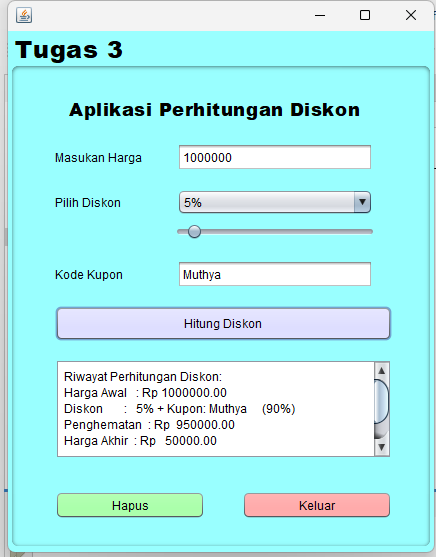

# AplikasiPerhitunganDiskon
 
Program ini dirancang untuk membantu pengguna menghitung harga akhir setelah diskon. Pengguna cukup memasukkan harga asli produk dan memilih persentase diskon yang diinginkan. Program kemudian akan menghitung harga setelah diskon dan menunjukkan jumlah penghematan yang diperoleh.

# Keunggulan Aplikasi

- *Penghitungan Diskon*: Aplikasi ini menghitung potongan harga berdasarkan diskon yang dipilih dan kode kupon yang dimasukkan.
- *Kode Kupon Tambahan*: Mendukung kode kupon untuk diskon tambahan, memberikan fleksibilitas dalam penentuan harga akhir.

# Pembuat Aplikasi

Tugas 3 - Muthya Adylla - 2210010476 - 5C Reguler Pagi Banjarmasin

# Fitur

Aplikasi ini menawarkan beberapa fitur utama:

1. *Penghitungan Harga Setelah Diskon*
Menghitung harga akhir produk setelah diskon berdasarkan persentase diskon yang dipilih dan kode kupon yang dimasukkan.

2. *Penggunaan Kode Kupon Diskon*
Mendukung beberapa kode kupon yang memberikan diskon tambahan, seperti kode-kode tertentu untuk diskon tambahan hingga 90%. Fitur ini memungkinkan pengguna untuk mendapatkan penawaran terbaik pada produk mereka.

3. *Riwayat Perhitungan Diskon*
Menyimpan dan menampilkan riwayat perhitungan diskon, sehingga pengguna dapat melacak penghematan dan harga akhir pada setiap transaksi yang mereka lakukan.

4. *Antarmuka Pengguna yang Sederhana dan Mudah*
Dengan Java, aplikasi ini menawarkan antarmuka intuitif yang memudahkan pengguna memasukkan harga, memilih persentase diskon, dan menambahkan kode kupon, serta tombol untuk memulai perhitungan.

5. *Penghapusan Riwayat Perhitungan*
Memungkinkan pengguna untuk menghapus riwayat perhitungan dengan mudah agar tampilan riwayat selalu bersih sesuai kebutuhan pengguna.

## Cara Menjalankan

1. Clone repositori ini ke dalam komputer Anda atau unduh sebagai ZIP.
2. Buka proyek di IDE pilihan Anda.
3. Pastikan Anda mengatur JDK yang benar di IDE Anda.
4. Jalankan PerhitunganDiskon untuk memulai aplikasi.

# Demo

